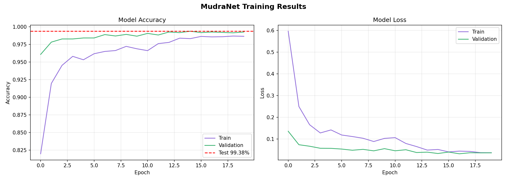

# 🤚 MudraNet — Bharatanatyam Mudra Recognition System

<div align="center">

[](https://python.org)
[](https://tensorflow.org)
[](https://mediapipe.dev)
[](https://streamlit.io)
[]()
[]()
[]()

**A deep learning system for real-time recognition of Bharatanatyam hand gestures (Mudras) achieving 99.38% test accuracy on 49 classes using a novel dual-input architecture combining MobileNetV2 and MediaPipe landmarks.**

</div>

---

## 📌 Table of Contents
- [Overview](#-overview)
- [Dataset](#-dataset)
- [Model Architecture](#-model-architecture)
- [Results](#-results)
- [Installation](#-installation)
- [Usage](#-usage)
- [Project Structure](#-project-structure)

---

## 🎯 Overview

**MudraNet** is a novel dual-input deep learning model that simultaneously processes:
- **Image Branch** — MobileNetV2 (pretrained ImageNet) extracts deep visual features (1280-d)
- **Landmark Branch** — MediaPipe 126-dimensional hand landmark features capture geometric structure

Both branches are fused via concatenation and classified into **49 Bharatanatyam mudra classes** with **99.38% test accuracy**.

### ✨ Key Highlights

| Feature | Detail |
|---|---|
| 🏆 Test Accuracy | **99.38%** |
| 🧠 Architecture | Novel dual-input MobileNetV2 + MediaPipe |
| 📦 Dataset | 28,431 images, 49 classes |
| ⚡ Real-time | Streamlit app with live camera |

---

## 📦 Dataset

**Bharatanatyam Mudra Dataset** — Raj et al. (2022), Springer

| Property | Value |
|---|---|
| Total Images | 28,431 |
| Processed (MediaPipe) | 23,808 (86% detection rate) |
| Total Classes | 49 mudras |
| Single-hand (Asamyukta Hasta) | 28 classes |
| Double-hand (Samyukta Hasta) | 21 classes |
| Volunteers | 15 trained Bharatanatyam dancers |
| Environment | Studio with green screen |
| Split | 70% train / 15% val / 15% test |

📥 **Dataset:** [github.com/jisharajr/Bharatanatyam-Mudra-Dataset](https://github.com/jisharajr/Bharatanatyam-Mudra-Dataset)

---

## 🧠 Model Architecture

```
┌─────────────────────────┐    ┌──────────────────────────┐
│   Input Image           │    │   Input Landmarks        │
│   (224 × 224 × 3)       │    │   (126,)                 │
└────────────┬────────────┘    └─────────────┬────────────┘
             │                               │
             ▼                               ▼
    ┌─────────────────┐            ┌──────────────────┐
    │  MobileNetV2    │            │   Dense (128)    │
    │  (ImageNet,     │            │   BatchNorm      │
    │   Frozen)       │            │   Dropout (0.3)  │
    │  GlobalAvgPool  │            │   Dense (64)     │
    │  BatchNorm      │            └────────┬─────────┘
    │  Dropout (0.3)  │                     │
    │  → 1280-d       │                     │
    └────────┬────────┘                     │
             │                              │
             └──────────┬───────────────────┘
                        │
                        ▼
               ┌─────────────────┐
               │   Concatenate   │
               │  1280 + 64      │
               │  = 1344-d       │
               └────────┬────────┘
                        │
                        ▼
               ┌─────────────────┐
               │  Dense (256)    │
               │  ReLU           │
               │  Dropout (0.4)  │
               └────────┬────────┘
                        │
                        ▼
               ┌─────────────────┐
               │  Dense (49)     │
               │  Softmax        │
               └─────────────────┘
                        │
                        ▼
               49 Mudra Classes
```

### Training Configuration

| Parameter | Value |
|---|---|
| Optimizer | Adam (lr = 0.001) |
| Loss Function | Categorical Cross Entropy |
| Batch Size | 32 |
| Epochs | 20 (Best: Epoch 17) |
| EarlyStopping | Patience = 5 |
| ReduceLROnPlateau | Factor = 0.5 |
| Total Parameters | 2,645,041 |
| Trainable Parameters | 387,425 |

---

## 📊 Results

| Split | Accuracy |
|---|---|
| **Test** | **99.38%** |
| Validation | 99.27% |
| Train | 98.66% |



---

## ⚙️ Installation

### Step 1 — Clone Repository
```bash
git clone https://github.com/madhur1702/MudraNet.git
cd MudraNet
```

### Step 2 — Install Dependencies
```bash
pip install -r requirements.txt
```

### Step 3 — Run App
```bash
streamlit run app.py
```

Open browser at `http://localhost:8501`

---

## 🚀 Usage

```
1. Run: streamlit run app.py
2. Choose mode:
   - 📷 Live Camera  → Show hand gesture to webcam
   - 🖼️ Upload Image → Upload any mudra image
3. See prediction with mudra name, confidence and meaning
```

---

## 📁 Project Structure

```
MudraNet/
│
├── app.py                      # Streamlit web application
├── MudraNet_Training.ipynb     # Complete training notebook
│
├── mudranet_final.keras        # Trained MudraNet model
├── class_names.json            # 49 mudra class names
├── label_encoder.pkl           # Sklearn label encoder
├── hand_landmarker.task        # MediaPipe hand landmark model
│
├── training_history.png        # Accuracy & loss training plots
├── confusion_matrix.png        # Test confusion matrix (49×49)
│
├── requirements.txt            # Python dependencies
└── README.md                   # This file
```

---

<div align="center">

**नृत्य — the language of the divine, spoken through the hands**

⭐ Star this repo if you found it helpful!

Made with ❤️ for preserving Indian Classical Dance Heritage

Developed by **Madhur Bhandarkar**

</div>
